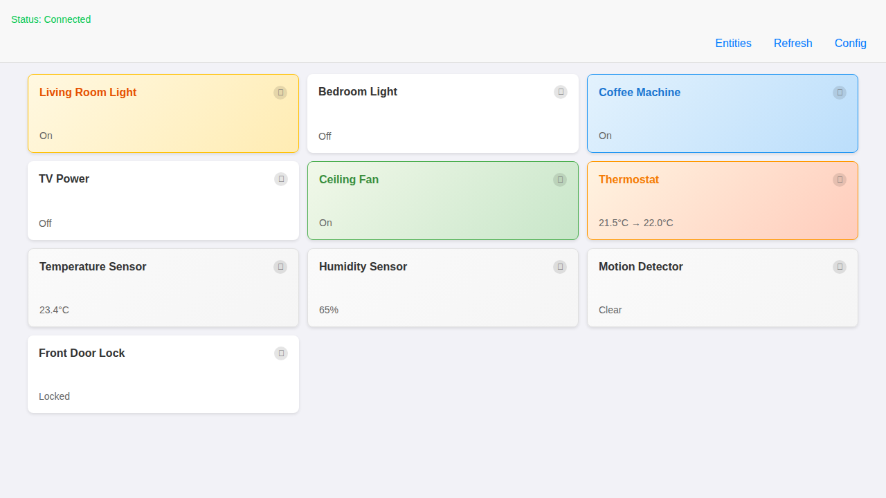
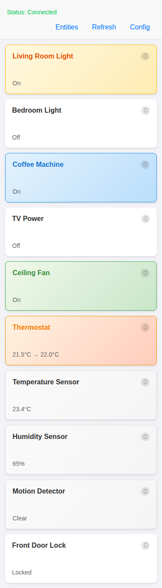
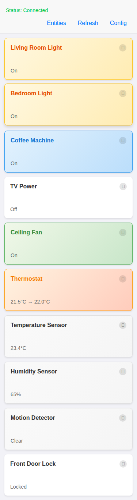

# HAiPAD UI Modernization - Apple Home Style Cards

This document showcases the modernized HAiPAD interface with Apple Home app-style cards and entity filtering functionality.

## New Features Implemented

### 1. Entity Filtering System
- **EntitySettingsViewController**: New interface to select which entities appear on the dashboard
- **Persistent Settings**: Entity preferences saved in NSUserDefaults
- **Entities Button**: Easy access to entity settings from the main dashboard

### 2. Modern Card-Based UI Design
- **UICollectionView**: Replaced UITableView with collection view for flexible card layout
- **EntityCardCell**: Custom collection view cells with modern card styling
- **Apple Home App Inspiration**: Similar visual design to Apple's Home app
- **iOS 9.3.5 Compatible**: All styling uses iOS 9.3.5 compatible APIs

### 3. Visual Design Features
- **Card Styling**: Rounded corners, subtle shadows, and clean typography
- **Color-coded States**: Different background colors for different entity types and states
  - **Lights**: Warm yellow when on, white when off
  - **Switches**: Light blue when on, white when off  
  - **Fans**: Light green when on, white when off
  - **Climate**: Orange/amber tint for thermostat entities
  - **Sensors**: Light gray background for read-only sensors
- **Responsive Layout**: Adapts to different screen sizes (2 columns on iPad, 1 on iPhone)
- **Interactive Elements**: Cards are tappable for control, info buttons for details

## Screenshots

### Desktop/iPad Layout (2 columns)

### Mobile/iPhone Layout (1 column) 

### Interactive State Changes

## Technical Implementation

### Files Added/Modified
- `EntitySettingsViewController.h/m` - Entity filtering interface
- `EntityCardCell.h/m` - Modern card-style collection view cell
- `DashboardViewController.h/m` - Updated to use collection view
- `Main.storyboard` - Updated with collection view and card cell layout

### iOS 9.3.5 Compatibility
- Uses `CALayer` properties for shadows and rounded corners
- Employs `UICollectionViewFlowLayout` (available in iOS 9)
- Avoids newer APIs that might not be available
- Uses compatible color and font APIs

### Entity State Display
The cards intelligently format entity states:
- **Lights/Switches/Fans**: Show "On" or "Off"
- **Sensors**: Show value with units (e.g., "23.4°C", "65%")
- **Climate**: Show current → target temperature
- **Binary Sensors**: Show "Detected" or "Clear"

### User Experience Improvements
- **Tap to Control**: Tap cards to toggle lights, switches, and fans
- **Info Button**: Tap (ⓘ) for detailed entity information
- **Visual Feedback**: Cards change appearance based on entity state
- **Entity Filtering**: Hide unwanted entities from the dashboard
- **Pull to Refresh**: Refresh control integrated with collection view

## Benefits Over Previous UI
1. **Modern Appearance**: Much more similar to Apple's Home app
2. **Better Information Density**: Cards show more information in an organized way
3. **Improved Usability**: Larger touch targets and clearer visual hierarchy
4. **Customizable**: Users can choose which entities to display
5. **Responsive**: Works well on both iPhone and iPad screen sizes
6. **Maintainable**: Clean separation of concerns with custom cell class

This modernization brings HAiPAD's interface in line with current iOS design patterns while maintaining full compatibility with iOS 9.3.5 devices.